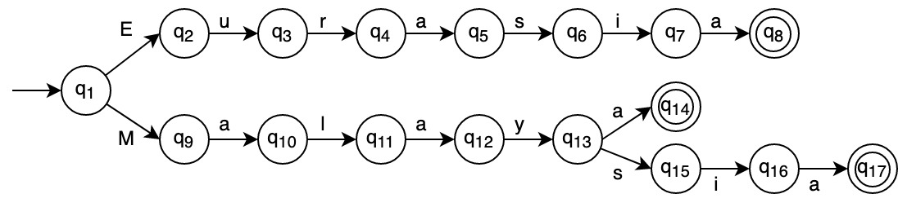

A simple string matcher using Deterministic Finite Automata (DFA)

DFA is a relatively simple concept but with a lot of applications. Among its uses is that it can be used for text matching.

In this assignment, a DFA is used to match against place names in the supplied input text. 

The scope is limited to place names present in the prepared sample text.

### Approach used
While there are many strategies to recognize place names, the strategy used in this assignment is to simply match against the list of place names supplied for each character or word in the paragraph.

The disadvantage of this approach is that it is inflexible to adapt to place names that are not supplied in the list given.

The advantage however is that this approach is able to achieve a very low number of false positives and it is also simple to understand and implement.

The _class_ programming facility is used to implement the DFA. The data structure implemented is quite resembling, or is in fact the trie data structure, a data structure that is frequently used for text matching.

The advantage of using a trie as opposed to other data structures like an array of patterns, is lower time and space complexity.

### Limitation

One severe limitation of the implemented DFA is it is not able to match against the longer pattern when a text segment matches against multiple patterns.

Given the limitation however, the results on the prepared sample text are quite good as there are quite few names that have prefixes of each other.

### Scope
The scope of the assignment can be summarized as follows:

1. Not all place names will be recognized, the aim is to match most of the place names present in the prepared sample text
2. The implemented DFA will only match against the shorter text pattern if there are two or more patterns that match a text segment

### DFA
Figure 1 gives a sample of the implemented DFA that matches against the words “Eurasia”, “Malaysia” and “Malaya”. As more and more words are added to the language, the size of the DFA also increases.

Figure 1: A Sample DFA

### Code walkthrough

1. [DFA class (`dfa.py`)](./doc/DFA.md)
2. [Helper functions (`helpers.py`)](./doc/Helper%20functions.md)
3. [Input and output](./doc/Input%20and%20Output.md)

### Libraries
External libraries used

* [colorama](https://pypi.org/project/colorama/)